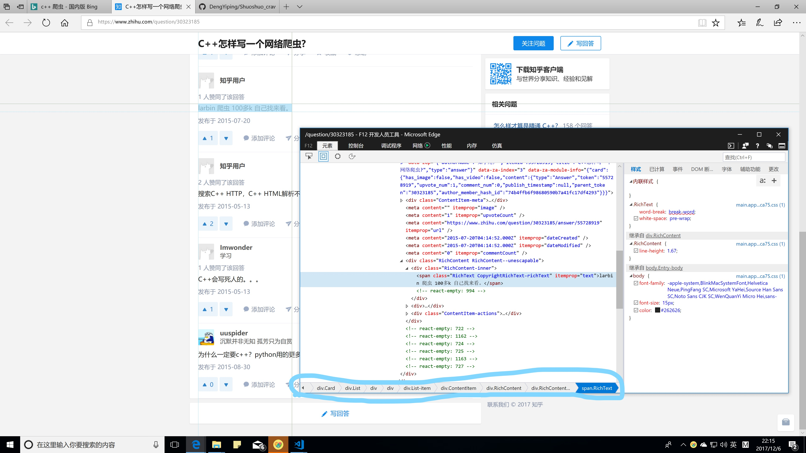

我们需要的数据多种多样，不可能什么都买，就算有钱，有的数据也不一定能买到。这个时候要获取这些数据，就要靠爬虫了。

爬虫届大佬很多，开源库和框架数不胜数。理论上，凡是能方便连接互联网的编程语言，都适合用来写爬虫，比如C#、Java、JavaScript、Python等，当然还有用R、Matlab这些不有点专业特色的语言写爬虫的，甚至用curl和Bash都可以写爬虫，只是好像较少听说过有用C++写爬虫的。我分别用过C#这种编译语言（Java应该类似）和JavaScript这种脚本语言写过多款爬虫，个人总结起来两种语言各有特色：
- 编译语言每次修改爬虫都要编译，我电脑比较渣，每次编译都要花点时间。但是可以轻松通过类型检查，保证每次GET参数的正确、返回值的直接解析等非常使用的功能。
- 脚本语言每次修改就可以直接运行了，但是填参数的时候就比较头疼了，需要反复检查有哪些参数、该填什么值，保证请求参数的格式正确。

自从学会了TypeScript之后，我个人就比较喜欢JavaScript和TypeScript语言，结合Node.js，可以达到比较好的写爬虫的效果，结合了编译语言和脚本语言共有的特点。只是搞得脚本有点复杂了，需要声明很多类型，指定变量类型……其实也是一个挺复杂的工作。虽然有点不像脚本，不够简洁，但能够提供类型检查还是省了不少事。

下面记录一下这次使用TypeScript编写爬虫的过程，以备后用。
<!-- more -->
# 库的使用
主要使用了下面两个库：
- web-request
- cheerio

## WebRequest：同步化的request请求

为什么要用`await`同步化request请求呢？不仅仅是因为`await`关键字是TypeScript和新JavaScript标准的特性，其实有很多比较好的用途：
- 避开JavaScript“回调大坑”。我个人还挺喜欢JavaScript以回调的方式异步化同步操作，曾经在爬虫的时候写了一个全回调的爬虫，`fs`库中有同步版本的函数都没有用其同步版本，全都是异步版本。事实证明，在高速爬虫的时候，使用异步版本的函数确实提高了爬虫效率。但是，编写起来那个**痛苦**啊。如果需要从返回的值里面判断还有没有下一页了，就要不停地递归啊。这真的是回调大坑，难读、难写、难调试。以至于后来再写爬虫，都避免爬虫过程中判断是否有下一页，都是提前算好有多少页，然后硬编码的，这样反而会节省很多时间。但是使用同步化的过程就比较好实现了。
- 减少因JavaScript的回调和闭包造成的错误。再爬虫的时候，为了防反爬，最简单的办法是人工设定等待时间，让爬虫慢一点。由于JavaScript回调的特点，笔者多次尝试，发现只能使用`setInterval()`函数实现。但是使用TypeScirpt的await关键字，可以直接编写一个`delay()`函数，让程序等待。

这个库的大多数用法和`request`库差不多，配置也是直接采用的`request`库的配置，只是可以以同步的方式编写异步代码，姑且称之为“同步化”把。例如，获取一个get请求的相应就是：
``` ts
import * as WebRequest from 'web-request'
var list_response = await WebRequest.get(`${site.url}/pg${i + 1}/`);
```
> 这里面使用`site.url`变量存储要访问的网页的基本地址，后面代表了页数。

全局配置的方法也和`request`库差不多，只是不需要返回一个新的`request`对象
``` ts
WebRequest.defaults({jar: true})
```
> 这里配置了使用Cookie。

我在上一次写高德API爬虫的时候，首次依靠同步化的request请求，完成了自动分析页数。瞬间感觉给人生节约了很多时间。

## cheerio：提供jQuery Selector的解析能力

在做前端的时候，定位一个元素，最常用的就是jQuery的Selector字符串。在Node.js中，可以使用cheerio这个简化的jQuery库来实现这一操作。

使用cheerio的方法很简单，就三步：
- 导入cheerio包：
    ``` ts
    import * as cheerio from 'cheerio'
    ```
- 创建`$`对象（`body`变量代表了HTML响应正文）
    ``` ts
    var $ = cheerio.load(body);
    ```
- 使用jQuery Selector即可（`info_object.max_num`是用于存储某个值的变量）
    ``` ts
    info_object.max_num = parseInt($("body div.content div.leftContent div.resultDes.clear h2.total.fl span").text().trim());
    ```

一般大型网页的页面都非常复杂，仅仅依靠分析HTML源码，可能毫无头绪。但是，使用浏览器的开发人员工具就非常方便啦，不仅可以直接快速定位页面元素，还可以直接给出Selector表达式。
<!--  -->


爬虫软件“八爪鱼”使用的是XPath表达式来定位页面元素（至少他的软件UI是这样做的）。我也尝试使用XPath，但是，由于HTML一些随意性，往往导致解析出错。而且，既然是网页，使用jQuery Selector表达式更简洁，更合适。

也有人说可以直接使用正则。确实可以，但是正则还要自己想是不是，如果有些复杂的正则还是挺费事的。用这个可以让开发人员工具自动分析，应该是更方便啊，除非你的电脑只有命令行。

当然，也不是什么都需要使用Selector表达式来定位的。如果只是像把坐标提出来，或者有一些其他特定的模式，直接使用正则表达式啊，比如
``` ts
var coord_string = /114.[0-9]*,30.[0-9]*/g.exec(body)[0];
```
这样就提取出来了经纬度坐标，而这个坐标是隐藏在页面一个`script`标签中的一个变量里。

不过这种方式有点问题。如果页面上的某些标签是使用脚本添加的，可能开发人员工具给出的Selector路径，不一定能在HTML源代码里找到。但是如果很重要的数据是通过前端脚本渲染上去的，那肯定会在一个变量里面保存这些数据。这个时候直接揪出这个变量就可以了，万事大吉，还不用自己去提取HTML元素。

# TypeScript编写爬虫
既然使用TypeScript便写爬虫，那么就使用一些TypeScript的特性吧。首先应该就是TypeScript的类型化特点。当然还少不了`await`关键字。

## API参数的类型化
一个请求的请求参数往往是确定的，在一个开放API中都会给出。你所想要的数据类型是固定的，这个要看你的需求。类型化编写爬虫的方式，就是保证这两个过程不出错。

例如，在利用高德API获取POI的时候，参数在文档中明确指出了（[高德地图API文档](http://lbs.amap.com/api/webservice/guide/api/search)）。我们如果照着这样的文档，编写一个接口或者一个类，可以实现一些自动化功能。同样，返回结果也可以编写一个类型，直接在构造函数中实现一些对结果的处理。

例如，对高德搜索的API进行类型化。首先创建一个接口，表示一些除了key之外的参数
``` ts
/** 输出结果的格式 */
export enum GaodePoiOutput {
    JSON, XML
}
/** 接口参数类型 */
export interface IGaodePoiApi {
    keywords: string[];
    types: string[];
    city?: string;
    citylimit?: boolean;
    children?: number;
    offset?: number;
    page?: number;
    building?: number;
    floor?: number;
    extensions?: string;
    output?: GaodePoiOutput;
}
```
然后，编写一个类，让其提供自动根据上述参数类型生成url的功能
``` ts
export class GaodePoiApi {
    baseurl: string;
    key: string;
    constructor(key: string) {
        this.baseurl = "http://restapi.amap.com/v3/place/text"
        this.key = key; 
    }
    /**
     * 获取参数指定的POI
     * @param parameters 请求参数
     */
    getUrl(parameters: IGaodePoiApi): string {
        var url = `${this.baseurl}?key=${this.key}`;
        for (var key in parameters) {
            if (parameters.hasOwnProperty(key)) {
                switch (key) {
                    case "keywords":
                        if (parameters.keywords.length > 0) {
                            url += `&${key}=`;
                            url += parameters.keywords[0]
                            for (var index = 1; index < parameters.keywords.length; index++) {
                                var element = parameters.keywords[index];
                                url += `|${parameters.keywords[index]}`;
                            }
                        }
                        break;
                    case "types":
                        if (parameters.types.length > 0) {
                            url += `&${key}=`;
                            url += parameters.types[0]
                            for (var index = 1; index < parameters.keywords.length; index++) {
                                var element = parameters.keywords[index];
                                url += `|${parameters.keywords[index]}`
                            }
                        }
                        break;
                    case "output":
                        url += `&${key}=`;
                        switch (parameters.output) {
                        case GaodePoiOutput.XML:
                            url += "XML";
                            break;
                        default:
                            url += "JSON";
                        }
                    default:
                        url += `&${key}=`;
                        url += `${parameters[key]}`;
                        break;
                }
            }
        }
        return url;
    }
}
```
这样直接调用`GaodePoiApi`对象的`getUrl()`函数即可生成需要的请求。

为什么不用request库的qs配置参数呢？这个参数其实非常坑，在高德API、百度API这种特别复杂的请求参数要求下，往往会出现问题。例如，如果一个参数可以是一个数组，你却不能直接把这个参数的值写成数组，这样会出现问题，只能手动利用将其变成字符串。我一开始使用的是`querystring.stringify()`函数，直接将qs对象序列化成字符串，但是后来发现还是有问题。但是使用TypeScript这样做之后，就觉得更加合理，一些复杂的参数格式也更加可控。

## 请求结果的类型化
### 开放API的示例
如在爬取高德地图API的时候，返回一个JSON时，可以直接将其指定一个类型，方便后面的操作。例如：
``` ts
/** 高德POI搜索结果模型 */
export interface IGaodePoiSearchResultModel {
    status: string;
    info?: string;
    infocode?: string;
    count?: string;
    pois?: IGaodePoiModel[];
    suggestion?: IGaodePoiSearchSuggestionsModel[];
}
/** 高德地图API */
export class GaodePoi {
    id: string;
    name: string;
    typecode: string;
    biz_type: any[];
    address: string;
    gjclng: number;
    gjclat: number;
    wgslng: number;
    wgslat: number;
    tel: string;
    distance: any[];
    biz_ext: any[];
    pname: string;
    cityname: string;
    adname: string;
    importance: any[];
    shopid: any[];
    shopinfo: string | number;
    poiweight: any[];
    constructor(parameters: IGaodePoiModel) {
        // 复制属性
        this.id = parameters.id;
        this.name = parameters.name;
        this.typecode = parameters.typecode;
        this.biz_type = parameters.biz_type;
        this.address = parameters.address;
        this.tel = parameters.tel;
        this.distance = parameters.distance;
        this.biz_ext = parameters.biz_ext;
        this.pname = parameters.pname;
        this.cityname = parameters.cityname;
        this.adname = parameters.adname;
        this.importance = parameters.importance;
        this.shopid = parameters.shopid;
        this.shopinfo = parameters.shopinfo;
        this.poiweight = parameters.poiweight;
        // 计算坐标
        var coords = parameters.location.split(",");
        this.gjclng = parseFloat(coords[0])
        this.gjclat = parseFloat(coords[1])
        var wgs = coordtransform.gcj02towgs84(this.gjclng, this.gjclat)
        this.wgslng = wgs[0];
        this.wgslat = wgs[1];
    }
    static getFields(): string[] {
        return [ "id", "name", "typecode", "biz_type", "address", "gjclng", "gjclat", "wgslng", "wgslat", "tel", "distance", "biz_ext", "pname", "cityname", "adname", "importance", "shopid", "shopinfo", "poiweight" ]
    }
}
```
这里面在构造函数中，调用了坐标转换库，转换了获取到的坐标。这个过程在获取结果时，在构造的过程中自动调用。

### HTML页面的示例
如果不是爬开放API，类型化也有一定的作用。例如爬取列表的时候，或者详细信息的时候，可以知道哪些属性时需要爬的，以及还有哪些属性没有爬下来。例如这段类型的声明
``` ts
export class ErshoufangListItem {
    id: string;
    title: string;
    link: string;
    property: string;
    propertylink: string;
    tags: Array<string>;
    total_price: number;
    unit_price: number;
    type_time: string;
    constructor(self?: ErshoufangListItem) {
        this.tags = new Array<string>();
        if (self) {
            this.title = self.title;
            this.link = self.link;
            this.property = self.property;
            this.propertylink = self.propertylink;
            this.tags = self.tags;
            this.total_price = self.total_price;
            this.unit_price = self.unit_price;
            this.type_time = self.type_time;
        }
    }
}
```
对应了下面这个列表页面中所需要提取的数据
<!--  -->


在爬取页面的时候，按照这个类型中声明的属性进行爬取即可。这一点可以用于多人协作中，一个人负责确定所要爬取的数据的原型（声明这个类），另一个人便写爬虫，其他人按照这个类型对数据进行分析。

## 延时函数编写
如果想让程序等待一定时间再继续爬取，`setInterval()`函数是可以使用的，但是又容易掉到回调坑里面。如果你再一个请求得到返回结果后又发起了一系列请求，这样两套`setInterval()`是统一不起来的，各计各的时间（因为request也用的是回调）。这个时候用TypeScript的`await`关键字调用一个延时函数（起名为`delay()`）是再好不过的。

`delay()`函数如下：
``` ts
/**
 * 延时函数
 * @param times 延时时间
 */
function delay(times: number): Promise<void>{
    return new Promise<void>((resolve, reject)=>{setTimeout(()=>resolve(), times)});
}
```
使用时直接用await关键字“调用”即可
``` ts
await delay(10000);
```

# 其他的话
## 抓包工具
要爬虫一定无法避免抓包。一般浏览器的开发人员工具又抓包的功能，同样也可以使用一些抓包工具来抓包。我比较喜欢使用抓包工具Fiddler。

使用浏览器自带的抓包工具，只能在当前页面抓包，而且如果新弹出了一个窗口，往往需要打开抓包工具后刷新一下页面才能抓到包。抓包的结果不能保存，不太方便。

使用Fiddler抓包就比较有优势，可以克服上述问题。但是Fiddler抓包范围太广，有些其他程序的http/https请求也会被抓到，因此抓包的结果可能要多很多。这个时候就要仔细分析哪些包是需要的，哪些包是不需要的。分析起来难度增大俩。

其他抓包工具我还没有试过，用过Fiddler之后感觉确实挺好用的，所以就没有试其他的了。

Fiddler还可以抓手机上的包，只需要设置代理即可，我曾经用这种方法抓了参考消息App的包，分析出它的API。如果一个手机软件用的是HTTPS协议，装一下Fiddler的证书即可。当然这时最好还是在安卓模拟器里面安装，以防个人信息无意中泄露。

## SourceMap选项
如果使用VSCode编写的话，可以直接调试。直接调试JavaScript是可以的，但是如何调试TypeScript呢？毕竟tsc编译生成的JS脚本太复杂了。

这需要在tsconfig.json文件和.vscode/launch.json中，分别开启sourceMap选项和sourceMaps选项。
``` json
// tsconfig.json
{
    "compilerOptions": {
        "lib": [
            "es2015"
        ],
        "sourceMap": true
    }
}
```
``` json
// .vscode/launch.json
{
    // 使用 IntelliSense 了解相关属性。 
    // 悬停以查看现有属性的描述。
    // 欲了解更多信息，请访问: https://go.microsoft.com/fwlink/?linkid=830387
    "version": "0.2.0",
    "configurations": [
        {
            "type": "node",
            "request": "launch",
            "name": "Launch Program",
            "program": "${file}",
            "sourceMaps": true,
            "outFiles": [
                "${workspaceFolder}/**/*.js"
            ]
        }
    ]
}
```

-----------------------------
暂时先记录到这里了。如果日后发现有一些需要补充的还会再添加上。如有错误欢迎大家指正。